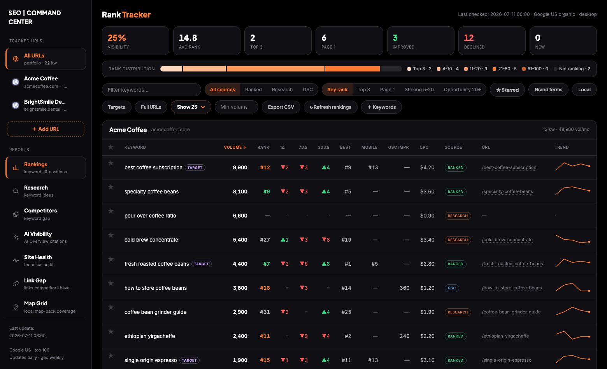
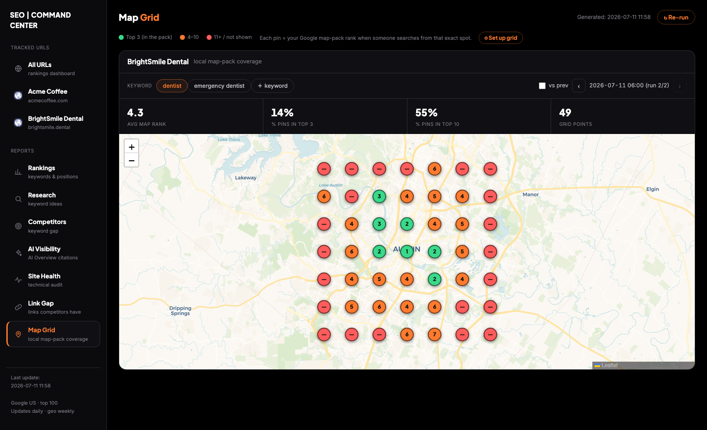
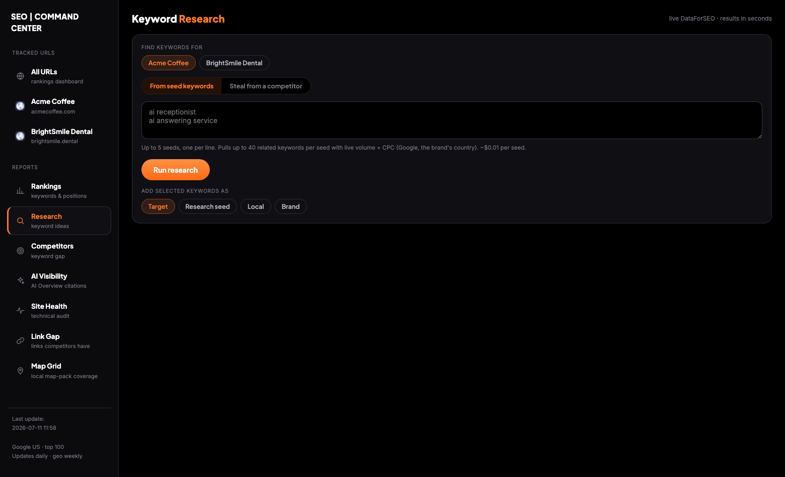

<div align="center">


# SEO Command Center

**A self-hosted SEO platform that costs ~$4/month instead of $139/month.**

Rank tracking · keyword research · competitor gaps · AI Overview visibility · site audits · link gaps · local map-pack grids

[](LICENSE)
[](https://www.python.org)
[](#)
[](#contributing)



</div>

## Why

SEO tools charge subscription prices for data they buy wholesale. Under the hood they're calling the same SERP APIs you can call yourself.

SEO Command Center is the whole dashboard, self-hosted, on top of [DataForSEO](https://dataforseo.com)'s pay-as-you-go API. No subscription, no seat pricing, no keyword caps — you pay cents for the exact SERPs you pull:

| | SEO Command Center | [Semrush Pro](https://www.semrush.com/pricing/) | [Ahrefs Lite](https://ahrefs.com/pricing) | [Local Falcon](https://www.localfalcon.com/pricing) |
|---|---|---|---|---|
| Monthly cost | **pay-as-you-go (~$4/mo typical\*)** | $139.95/mo | $129/mo | from $24.99/mo |
| Commitment | none — prepaid API credits | subscription | subscription | subscription |
| Rank tracking, research, competitor gap, site audit, AI Overview tracking, local grids | all included | partial | partial | grids only |
| Your data, on your server | yes — one SQLite file | no | no | no |

\* Measured on a real deployment: 570 keywords across 5 sites updated daily, plus weekly local map grids and brand-SERP checks — **$3.55/month** in API costs. A 7×7 map-grid scan is $0.29; a keyword-research pull is ~$0.02.

## What you get

Seven pages, one dark command center, everything driven from the browser:

| Page | What it does |
|---|---|
| **Rankings** | Daily positions, 1d/7d/30d deltas, best-ever, sparklines, history charts, visibility score, GSC impressions/clicks, mobile ranks, CSV export |
| **Research** | Live keyword ideas from seeds or any competitor's domain — volume, CPC, competition — checkbox → tracked |
| **Competitors** | Who actually outranks you + every keyword they rank for that you don't |
| **AI Visibility** | Which of your keywords trigger Google AI Overviews, whether you're cited, and who is |
| **Site Health** | Zero-cost technical crawler: broken links, duplicate titles, missing metas, thin content, per-site score |
| **Link Gap** | Domains linking to your rivals but not you, junk-filtered and classified by how to actually get the link |
| **Map Grid** | LocalFalcon-style GPS grid: your Google map-pack rank from 49+ points around your city, plus who holds the top 3 at every pin |

<div align="center">

<br><br>

</div>

More screenshots in [docs/screenshots](docs/screenshots).

## Quickstart

**Try it with sample data first (no account needed):**

```bash
git clone https://github.com/testedmedia/seo-command-center.git
cd seo-command-center
python3 demo.py && python3 worker.py serve
# → http://localhost:8000
```

**Track your own site:**

```bash
python3 setup.py            # guided: DataForSEO creds (validated live), your sites, options
python3 worker.py run all   # first pull — typically $0.10-0.50
python3 worker.py serve     # local dashboard
```

That's it. Python 3.9+ standard library only — no pip install, no Docker, no database server (SQLite file).

### What you need

| Requirement | For | Cost |
|---|---|---|
| Python 3.9+ | everything | free |
| [DataForSEO account](https://dataforseo.com) | rankings, research, competitors, map grids | pay-as-you-go, ~$4/mo typical usage (prepaid credits last months) |
| Cloudflare account (optional) | hosted dashboard + in-browser buttons | free tier |
| Google Search Console (optional) | impressions/clicks + found keywords | free |
| Node.js (optional) | only for `worker.py deploy` (wrangler) | free |

## Hosted mode

Local mode is read-only pages. Hosted mode (free Cloudflare Pages) unlocks the buttons: refresh any report, add keywords/sites, delete keywords, live research, and map-grid setup from the browser — protected by a login page (orange matrix included).

```bash
python3 worker.py deploy-config   # creates the Pages project + queue, pushes your secrets
python3 worker.py deploy          # ship the dashboard
python3 worker.py loop            # poll the queue + daily auto-refresh (cron/systemd/launchd)
```

Buttons queue work into Cloudflare KV; `worker.py loop` on any machine (a laptop, a $4 VPS, a Raspberry Pi) picks jobs up within 2 minutes, runs them, and redeploys. Your API credentials only ever live in your `.env` and as encrypted Pages secrets.

## Connect Search Console (optional)

1. Create an OAuth client (Desktop) in [Google Cloud Console](https://console.cloud.google.com/apis/credentials), enable the Search Console API.
2. Save the client JSON to `credentials/gsc-client-secret.json`.
3. Run any OAuth helper to get a refresh token into `credentials/gsc-tokens.json` (`{"refresh_token": "..."}`).
4. That's it — rankings runs will merge impressions, clicks and Google-reported positions, and auto-discover keywords you already get traffic for.

## How it works

```
┌────────────────────┐     ┌──────────────────────┐     ┌─────────────────────┐
│  DataForSEO API    │ ←── │  tracker/*.py        │ ──→ │  data/ranks.db      │
│  (SERPs, keywords, │     │  stdlib Python,      │     │  (SQLite, all       │
│   maps, backlinks) │     │  one file per report │     │   history forever)  │
└────────────────────┘     └──────────┬───────────┘     └─────────────────────┘
                                      │ renders
                                      ▼
                           ┌──────────────────────┐     ┌─────────────────────┐
                           │  site/*.html         │ ──→ │  localhost or       │
                           │  self-contained dark │     │  Cloudflare Pages   │
                           │  dashboard pages     │     │  (+ auth, buttons)  │
                           └──────────────────────┘     └─────────────────────┘
```

- **No framework.** Each report is one Python file that pulls data, stores history in SQLite, and renders a self-contained HTML page.
- **No backend server.** Hosted interactivity is three tiny Cloudflare Pages Functions (auth, queue, research proxy).
- **No lock-in.** Your entire SEO history is one SQLite file you can query directly.

## Cost control, built in

- Manual refreshes are capped per tool per day (default 2) and research pulls per day (default 20) — a shared dashboard can't drain your balance.
- Every research pull and grid save shows its dollar cost before/after running.
- The keyword cap per site (default 100, configurable) bounds the daily tracking spend.
- Weekly-only for the expensive stuff (map grids, true-SERP brand checks) by default.

## FAQ

**Is the ranking data as good as Semrush/Ahrefs?**
It's the same class of data — DataForSEO is one of the SERP providers this industry runs on. Tracked positions come from live Google SERPs (top 100, any country/language).

**Can I track competitors' sites too?**
Yes — add any domain as a site, or use Research → "Steal from a competitor" and the Competitors gap report.

**Multiple sites?**
Unlimited. Cost scales with keywords, not sites.

**White-label / client dashboards?**
Set `BRAND_NAME` (and optionally `LOGO_FILE`) in `.env`, deploy per client. Each deployment has its own access key.

**Why not just use rank tracker X?**
If you're happy paying monthly SaaS pricing, do that. This is for people who want the whole stack, their own data, and a bill that rounds to a coffee.

## Contributing

PRs welcome. The codebase is intentionally boring: stdlib Python, one file per report, no build step. Add a report = one script that writes JSON + HTML, one nav entry.

## License

[MIT](LICENSE)

---

<div align="center">
If this saved you $100+/month, a star helps other people find it.
</div>
